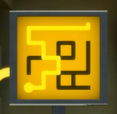
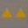

Title: 见证者游戏谜题解析
Date: 2016-02-17 14:34
modified: 2016-02-18 12:55
Tags: game, puzzle, math
Category: 游戏
Slug: the-witness-puzzles
Author: Levi G
Status: published

# 略作定义

所有谜题都可以这样描述：

* 谜题题板是在一个平面或空间曲面上的格线阵列。
* 谜题解答是无交叉的一笔画图形。
    * 一笔画轨迹必须在题板给出的格线上。以圆点为起点，以方格阵列凸点为终点。
    * 一笔画轨迹本身必须满足阵列中图形的限定条件。
    * 一笔画轨迹将题板划分成一个或多个联通区域，每个联通区域必须满足阵列中图形的限定条件。

# 不同图形的限定含义

图形|位置|限定|图例
-|-|-|-
格线|-|一笔画路径。
圆点|格线交点|一笔画起点。
出口|边界格线交点延伸到图形外|一笔画终点。
圆角方形|方格内|所在连通区域内不可出现其它颜色的圆角方形。|
正六边形|格线交点或格线上|一笔画必须经过此点。黑色可由任一颜色一笔画轨迹经过；其它颜色必须由同色轨迹经过。|
对称|题板整体是轴对称或中心对称的|一笔画出多条轨迹。对称性与题板本身相同。|
俄罗斯方块/ 多联骨牌|方格内|所在连通区域的形状必须可由其中的所有俄罗斯方块拼成。|
空心俄罗斯方块/ 反多联骨牌|方格内|修正所在联通区域内的某块俄罗斯方块，将之挖去空心俄罗斯方块形状的一部分。|
八角星/太阳|方格内|所在联通区域必须存在且仅有一个同一颜色的特定图形（圆角方形、八角星）。|
三通/倒置的Y|方格内|去除所在联通区域内的一个未满足限定条件的图形。|
三角|方格内|方格内有几个三角形表示在它周围，一笔画需要经过几条边。|

# 可能的隐藏线索

* 与其它题板的位置关系。
* 投射到题板上的阴影。阻断或引导。
* 特定位置观察题板，题板前的景物。阻断或引导。
* 特定位置观察题板，题板后的景物。阻断或引导。
* 观察题板附近的特定景物，与题板图形有映射关系。
* 环境里的特定声音信号。

# 其它资源

* [IGN 见证者 Wiki](http://www.ign.com/wikis/the-witness) 上，[关于谜题类型的介绍](http://www.ign.com/wikis/the-witness/Puzzle_Types)
* 优酷上，[混沌王的实况视频](http://v.youku.com/v_show/id_XMTQ1ODMzNzc0NA==.html?f=26612444)
* 写 putty 的牛人 [Simon Tatham](http://www.chiark.greenend.org.uk/~sgtatham/) 的全平台[谜题集](http://www.chiark.greenend.org.uk/~sgtatham/puzzles/)。

    > 个人比较喜欢这个谜题系列。尤其是 Galaxies、Light Up、Loopy、Pattern、Pearl、Range、Signpost、Slant、Tents、Unequal（真的不是全部……）。

    其中这两个与见证者中的谜题有共性：

    * Galaxies（[说明](http://www.chiark.greenend.org.uk/~sgtatham/puzzles/doc/galaxies.html#galaxies)，[在线](http://www.chiark.greenend.org.uk/~sgtatham/puzzles/js/galaxies.html)）适合练习关于对称性相关的谜题。
    * Loopy（[说明](http://www.chiark.greenend.org.uk/~sgtatham/puzzles/doc/loopy.html#loopy)，[在线](http://www.chiark.greenend.org.uk/~sgtatham/puzzles/js/loopy.html)）适合练习关于三角形的谜题。

* 关于多联骨牌：
    * [Wiki 页面](https://en.wikipedia.org/wiki/Polyomino)，中文百科目前还没有。
    * 玩数学的文科大神 [Matrix67](http://www.matrix67.com/) 的[文章集](http://www.matrix67.com/blog/archives/tag/%E5%A4%9A%E8%81%94%E9%AA%A8%E7%89%8C)
    * 果壳上的[文章集](http://www.guokr.com/search/all/?wd=%E5%A4%9A%E8%81%94%E9%AA%A8%E7%89%8C)
    * 早有立体的五阶多联骨牌玩具卖——『动脑筋的十二块』或『伤脑筋十二块』——约二十年前我自己还用牛皮纸做过一个。购买链接自寻。
